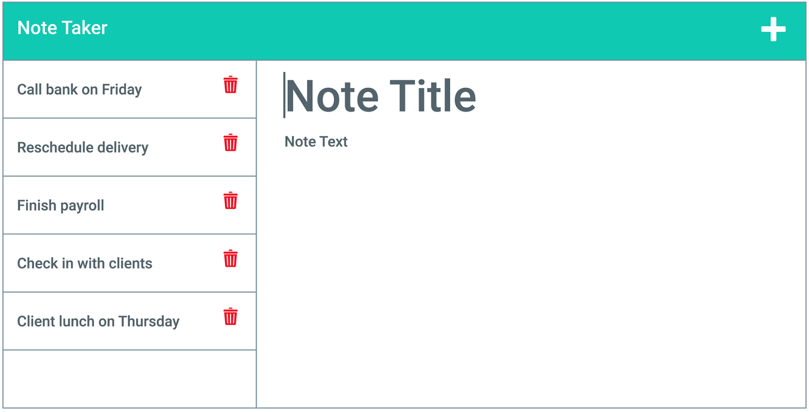
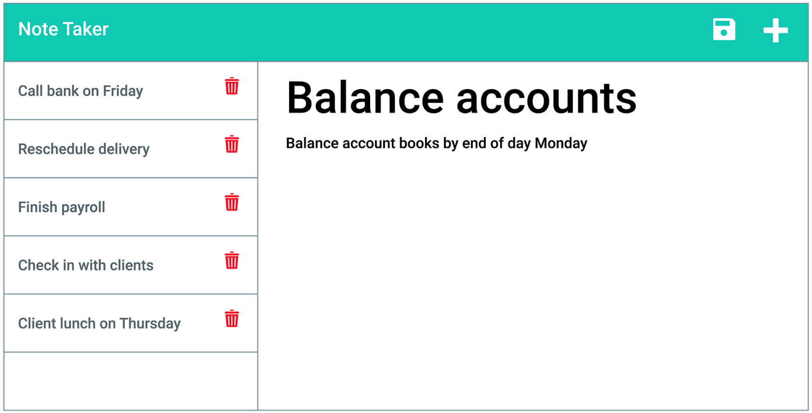

# personal-note-taker

## Description
 The purpose of this project was to build a note taking application using the backend to set up an API to connect the front end to a server. The user can use the terminal to connect the localhost to a specified port in order to run the application in the user's web browser. The motivation behind this project was to better understand how to connect the backend to the front end in web development. Furthermore, daily notes can be taken by the user for reminders on day to day activities. This project really helped solidify the function of backend web development. I now have a much stronger concept of how the front end relies on the backend to store data to a server as opposed to the browser's local storage. I also have a better understanding of how to connect the front end to the backend using a framework such as express.    

 ## Table of Contents

- [Installation](#installation)
- [Usage](#usage)
- [License](#license)
- [How to contribute](#how-to-contribute)
- [Tests](#tests)
- [Questions](#questions)

## Installation
To properly run this application, clone a copy of the repository from GitHub. Next, install inquirer by typing "npm install inqurier@8.2.4". In the terminal, navigate to the directory where the index.js file is located. In the terminal, type "node server.js". Copy the "localhost" url and paste it into the browser search bar. The home page should appear in the browser. Here is a link to the GitHub repository: https://github.com/SeanBL/personal-note-taker

The user can also access the full application on Heroku. 
Here is a link to the deployed application on heroku: https://personal-note-taker-11.herokuapp.com/

## Usage
At the home page, the user can click on the "Get Started" button to access the note taking function. The user can input a note title with the body of the note. Once the user has finished writing the note, the user can click on the save icon in the top right corner to store the note on the left hand side of the page. The user can click on the note title on the left side to display the body of the note on the right side of the screen. The user can also click on the plus icon in the upper right hand corner to create a new note. The user can finally delete a note by clicking on any of the trash icons, located on the left side of the page.
 
 

 

## License
MIT License

A short and simple permissive license with conditions only requiring preservation of copyright and license notices. Licensed works, modifications, and larger works may be distributed under different terms and without source code. Refer to link for more details: https://choosealicense.com/licenses/mit/

## How to Contribute
Feel free to contribute to my project on GitHub. A link to the repository is above and a link to my GitHub page is provided in the Questions section.

## Tests
N/A 

## Questions
Feel free to view and contribute to my work on GitHub.
https://github.com/SeanBL

For additional questions, can also reach me through my email address here:
seanbristol81@gmail.com